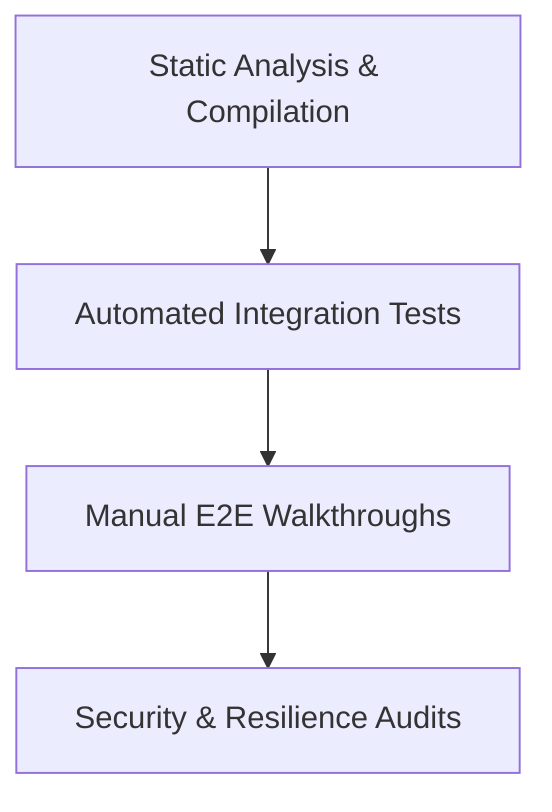

# FACELOCK: Quality Assurance Blueprint & Test Cases

This document provides a systematic framework to test, verify, and validate the Face Recognition Login System (FACELOCK). It includes verification methodologies, functional and UI/UX testing scripts, comprehensive test cases, and automated testing templates.

---

## 1. How to Ascertain the Code is Bug-Free, Functional, and Usable

To guarantee the reliability, security, and usability of the application, we employ a **multi-tiered validation pyramid**:



### 1. Static Analysis & Compilation
*   **TypeScript Checks**: Run compilation checks on the client and server (`npx tsc --noEmit` in both `/frontend` and `/backend`) to ensure zero type errors.
*   **Python Linting**: Leverage Pyrefly or flake8 on `ai-service` to confirm imports, scopes, and variable types are valid.

### 2. Automated Integration Checks
*   Run unit tests targeting cryptographic services (bcrypt hashing) and matrix similarity operations.
*   Validate endpoints using automated mock clients (e.g. Playwright or Postman) under simulated constraints.

### 3. Manual E2E Walkthroughs
*   Follow the structural scripts in the **Tester's Guide** to confirm that frontend actions correspond to expected backend database states and email dispatches.

### 4. Security & Resilience Audits
*   Verify that JWT authentication tokens are protected inside HTTP-Only, SameSite=Strict cookies (inaccessible via `document.cookie`).
*   Confirm that registration completes gracefully even if external SMTP services are offline.

---

## 2. Tester's Guide (Functionality & UI/UX)

Use this guide to test the system manually in a systematic sequence.

### A. UI/UX Verification Checklist
*   [ ] **Theme Consistency**: Toggle between Light and Dark mode using the theme switcher. Verify that all backgrounds, cards, typography, and buttons transition smoothly without color flashing or unreadable text.
*   [ ] **Webcam Mirroring**: Verify that the camera feed is mirrored horizontally (`transform: scaleX(-1)`) to match natural user movement, and that the captured canvas matches the display mirror.
*   [ ] **Visual Feedback**: Confirm that active input states show a high-contrast focus border and that buttons enter a disabled state (`btn-disabled`) with a loading spinner during API transactions.
*   [ ] **Responsive Collapse**: Shrink the viewport to mobile sizes (e.g., 375px wide). Verify that forms collapse to a single column, borders shift correctly, and text remains readable without horizontal overflow.

### B. Functional Walkthrough Sequence
1.  **Form Validation**: Navigate to `/register`. Attempt to submit empty inputs, invalid emails, and passwords under 8 characters. Confirm clear validation messages are shown.
2.  **Webcam Captures**: Complete step 1 of registration, and advance to step 2. Capture 5 distinct face angles. Ensure the counter increments and alerts the user on each capture.
3.  **Onboarding Verification**: Submit the registration. Verify you are redirected to `/login`, a success toast is shown, and a welcome HTML email arrives in your inbox.
4.  **Credentials Login**: Log in using your email and password. Verify you are redirected to the Dashboard and the secure session cookie `token` is set in the browser storage tab.
5.  **Session Logout**: Click **Sign Out**. Verify the cookie is deleted and you cannot return to `/dashboard` via browser back navigation.
6.  **Biometric Login**: Navigate back to `/login`, toggle to **Face Recognition**, capture your face, and verify it matches, signs you in, and redirects to the Dashboard.

---

## 3. Comprehensive Test Cases Suite

### Test Case Category Definitions
*   **Valid Inputs**: Expected standard usage (Positive testing).
*   **Invalid Inputs**: Erroneous input values, validation blocks (Negative testing).
*   **Useful Test Cases**: Real-world practical scenarios (concurrency, timeouts).
*   **Unavoidable Cases**: Graceful recoveries during external infrastructure failures.
*   **Unknown Scenarios**: Edge conditions, hardware dropouts, unexpected browser actions.
*   **Out-of-Context Cases**: Security vulnerability validation, bypass attempts.

| Test Case ID | Target Feature | Scenario Description | Inputs / Action | Expected Result | Category |
| :--- | :--- | :--- | :--- | :--- | :--- |
| **TC-REG-001** | Registration | Register profile with valid information | Correct name, email, password $\ge$ 8 chars, 5 valid face scans | User created, welcome email received, redirected to login | **Valid Input** |
| **TC-REG-002** | Registration | Register with invalid email syntax | Email: `qa-invalid-format` | UI/Backend blocks submission with "Please enter a valid email" | **Invalid Input** |
| **TC-REG-003** | Registration | Register with short password | Password: `pass` (4 chars) | UI/Backend blocks submission with "Password must contain $\ge$ 8 chars" | **Invalid Input** |
| **TC-REG-004** | Registration | Register with mismatched passwords | Password: `password123`<br>Confirm: `password321` | UI blocks submission with "Passwords do not match" | **Invalid Input** |
| **TC-REG-005** | Registration | Register duplicate email address | Existing email in DB | Registration fails, returns "Email is already registered" | **Invalid Input** |
| **TC-REG-006** | Registration | Register duplicate face vector | Face matches existing profile | Registration fails, returns "This face is already registered" | **Useful Case** |
| **TC-REG-007** | Registration | Run multiple concurrent registrations | Multiple clients registering at the same millisecond | MongoDB database queries run concurrently without connection leaks | **Useful Case** |
| **TC-REG-008** | Registration | SMTP service is offline / credentials wrong | Run registration with invalid `EMAIL_PASS` in `.env` | Registration succeeds; backend catches SMTP error and logs it | **Unavoidable** |
| **TC-REG-009** | Registration | AI service is offline or times out | Trigger registration with FastAPI service stopped | API returns 400 "AI Service is currently unavailable" within 8s | **Unavoidable** |
| **TC-REG-010** | Registration | Submit non-face images | Upload image of a room/object (no face detected) | AI Service returns 400 "Face not detected" gracefully | **Unknown** |
| **TC-REG-011** | Registration | Submit image with multiple faces | Camera frame contains 2 or more people | AI Service returns 400 "Multiple faces detected" gracefully | **Unknown** |
| **TC-REG-012** | Registration | Camera disconnected mid-capture | Unplug camera during step 2 of registration | Browser catches camera error, displays "Camera hardware unavailable" | **Unknown** |
| **TC-AUTH-001**| Login | Authenticate with valid credentials | Correct email and password | Cookie `token` set, redirects to dashboard, toast shown | **Valid Input** |
| **TC-AUTH-002**| Login | Authenticate with wrong password | Correct email, wrong password | Returns "Invalid credentials" (no detail leak to prevent harvesting) | **Invalid Input** |
| **TC-AUTH-003**| Login | Authenticate with non-existent email | Unregistered email | Returns "Invalid credentials" (no detail leak to prevent harvesting) | **Invalid Input** |
| **TC-AUTH-004**| Login | Authenticate with valid face scan | Mirror scan matches user embedding | Cookie `token` set, redirects to dashboard, toast shown | **Valid Input** |
| **TC-AUTH-005**| Login | Authenticate with un-registered face | Scan face not stored in DB | Returns "Face verification failed" | **Invalid Input** |
| **TC-AUTH-006**| Security | Verify JWT cookie is HTTP-only | Inspect cookies in developer tools | `token` cookie has the `HttpOnly` flag enabled; inaccessible via JS | **Out-of-Context** |
| **TC-AUTH-007**| Security | Access Dashboard without cookie | Clear cookies and navigate to `/dashboard` | Route guard detects `isAuthenticated` is falsy, redirects to `/login` | **Out-of-Context** |
| **TC-AUTH-008**| Security | Brute force password logins | Submit 150 login requests in 5 minutes | `express-rate-limit` blocks requests with 429 Too Many Requests | **Out-of-Context** |

---

## 4. Automated Testing Strategy & Bonus Insights

To streamline QA cycles and eliminate manual repetition, you can automate these test cases.

### A. End-to-End Testing (Playwright)
Playwright is ideal for testing UI rendering, camera mock captures, and state transitions.

#### Example Playwright Test Script (`e2e.spec.ts`)
Create this test script to automate registration validations:
```typescript
import { test, expect } from '@playwright/test';

test.describe('FaceLock Client Form Validations', () => {
  test.beforeEach(async ({ page }) => {
    await page.goto('http://localhost:5173/register');
  });

  test('should show error for invalid email', async ({ page }) => {
    await page.fill('input[placeholder="Full Name"]', 'QA Test');
    await page.fill('input[type="email"]', 'invalid-email');
    await page.fill('input[name="password"]', 'Password123');
    await page.fill('input[name="confirmPassword"]', 'Password123');
    await page.click('button:has-text("Next")');

    const error = page.locator('.error-message');
    await expect(error).toContainText('Please enter a valid email address.');
  });

  test('should show error for mismatched passwords', async ({ page }) => {
    await page.fill('input[placeholder="Full Name"]', 'QA Test');
    await page.fill('input[type="email"]', 'qa@gmail.com');
    await page.fill('input[name="password"]', 'Password123');
    await page.fill('input[name="confirmPassword"]', 'Password321');
    await page.click('button:has-text("Next")');

    const error = page.locator('.error-message');
    await expect(error).toContainText('Passwords do not match.');
  });
});
```

### B. Python API Testing (pytest)
FastAPI routes can be tested directly in Python using `TestClient`.

#### Example Pytest Script (`test_ai.py`)
```python
from fastapi.testclient import TestClient
from app.main import app

client = TestClient(app)

def test_health_endpoint():
    response = client.get("/health")
    assert response.status_code == 200
    assert response.json() == {"status": "ok", "service": "ai-service"}

def test_verify_face_empty_candidates():
    payload = {
        "live_embedding": [0.1] * 512,
        "candidates": [],
        "threshold": 0.70
    }
    response = client.post("/verify-face", json=payload)
    assert response.status_code == 200
    assert response.json()["match"] is False
    assert response.json()["score"] == 0.0
```

### C. Recommended Testing Toolkit
1.  **Postman / Newman**: For API contract validation. Write tests inside Postman requests and run them in CI/CD using Newman.
2.  **Lighthouse**: Integrated into Chrome DevTools. Use it to check Accessibility (a11y), Performance, and Best Practices score.
3.  **MSW (Mock Service Worker)**: To intercept network calls in frontend unit tests, letting you mock API failures easily.
